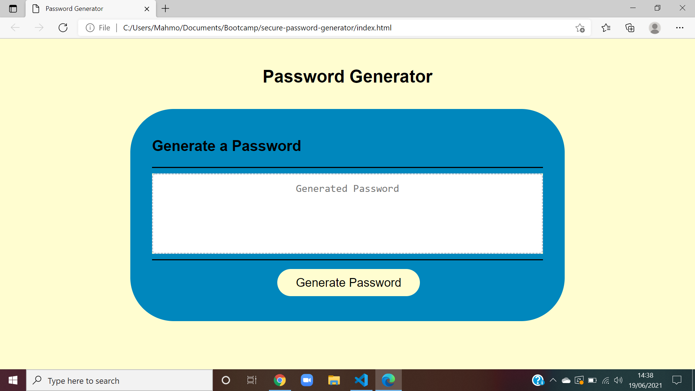

# secure-password-generator
# Description 
### I was tasked to develope an application that will allow employees to generate random and secured passwords based on predefined criteria.

# Usage 
    * User will click the button to generate a password
    * After clicking the user will be prompted with different character options like (uper-case lettters, lower-case letters, symbols and numbers)
    * After the user selects spcific criteria, a password will be generated for the user.

# criteria 
    * Must be between 8 and 128 characters long
    * Must choose at least 1 of the character options:
        * numbers
        * lower case letter
        * upper case letter

# Links 
Repository link: https://github.com/Mahmoudcali02/secure-password-generator

Deployed link:

# screenshot 

# 
#  References and tutorials consulted 
W3schools: https://www.w3schools.com/

The Net Ninja: https://www.youtube.com/channel/UCW5YeuERMmlnqo4oq8vwUpg

Javascript resource site: https://www.javascript.com/resources
    

